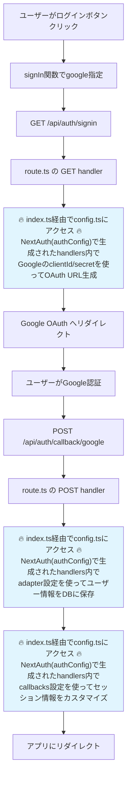
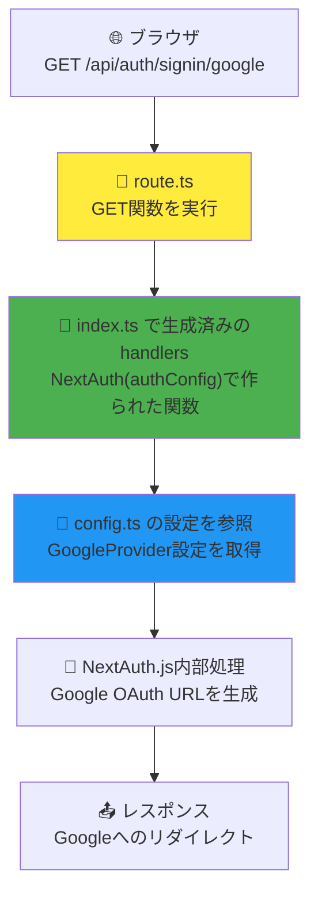
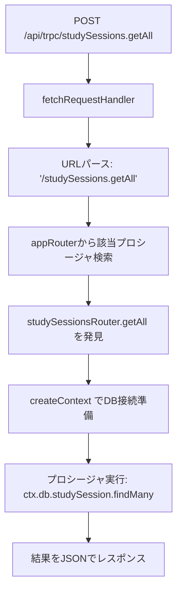
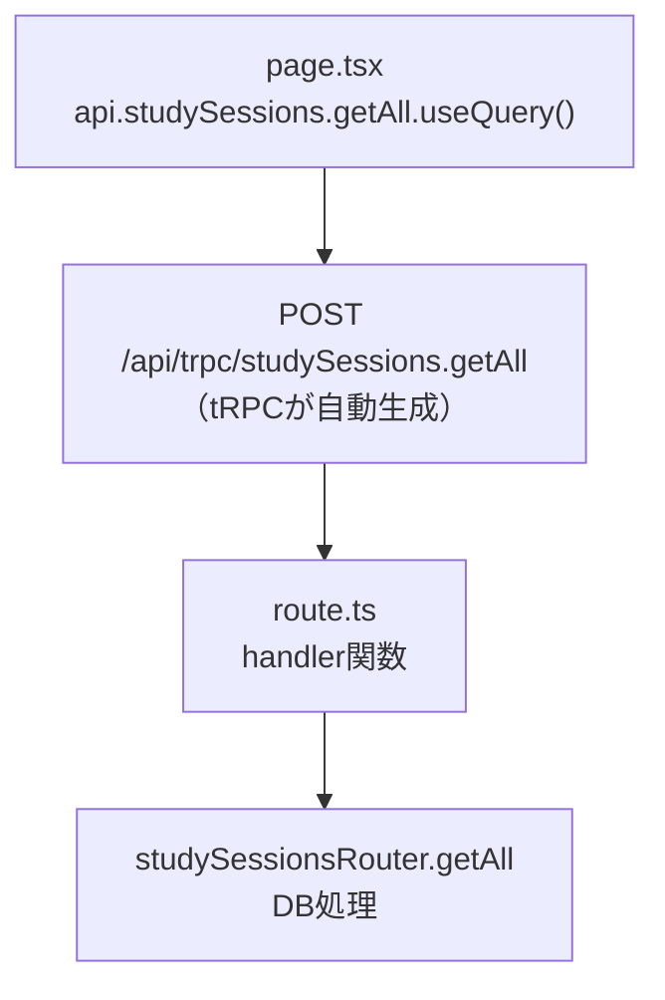

```mermaid
graph TD
    A[ユーザーがログインボタンクリック] --> B[signIn関数でgoogle指定]
    B --> C[GET /api/auth/signin]
    C --> D[route.ts の GET handler]
    D --> E["🔥 index.ts経由でconfig.tsにアクセス 🔥<br/>NextAuth(authConfig)で生成されたhandlers内で<br/>GoogleのclientId/secretを使ってOAuth URL生成"]
    E --> F[Google OAuth へリダイレクト]
    F --> G[ユーザーがGoogle認証]
    G --> H[POST /api/auth/callback/google]
    H --> I[route.ts の POST handler]
    I --> J["🔥 index.ts経由でconfig.tsにアクセス 🔥<br/>NextAuth(authConfig)で生成されたhandlers内で<br/>adapter設定を使ってユーザー情報をDBに保存"]
    J --> K["🔥 index.ts経由でconfig.tsにアクセス 🔥<br/>NextAuth(authConfig)で生成されたhandlers内で<br/>callbacks設定を使ってセッション情報をカスタマイズ"]
    K --> L[アプリにリダイレクト]

    style E fill:#e1f5fe
    style J fill:#e1f5fe  
    style K fill:#e1f5fe
```

```mermaid
graph TD
    A["🌐 ブラウザ<br/>GET /api/auth/signin/google"] 
    --> B["📁 route.ts<br/>GET関数を実行"]
    
    B --> C["📁 index.ts で生成済みのhandlers<br/>NextAuth(authConfig)で作られた関数"]
    
    C --> D["📁 config.ts の設定を参照<br/>GoogleProvider設定を取得"]
    
    D --> E["🔄 NextAuth.js内部処理<br/>Google OAuth URLを生成"]
    
    E --> F["📤 レスポンス<br/>Googleへのリダイレクト"]
    
    style B fill:#ffeb3b
    style C fill:#4caf50
    style D fill:#2196f3
```

```mermaid
graph TD
    A["POST /api/trpc/studySessions.getAll"] --> B[fetchRequestHandler]
    
    B --> C[URLパース: '/studySessions.getAll']
    C --> D[appRouterから該当プロシージャ検索]
    D --> E[studySessionsRouter.getAll を発見]
    E --> F[createContext でDB接続準備]
    F --> G[プロシージャ実行: ctx.db.studySession.findMany]
    G --> H[結果をJSONでレスポンス]
```

```mermaid
graph TD
    A["page.tsx<br/>api.studySessions.getAll.useQuery()"] 
    --> B["POST /api/trpc/studySessions.getAll<br/>（tRPCが自動生成）"]
    --> C["route.ts<br/>handler関数"]
    --> D["studySessionsRouter.getAll<br/>DB処理"]

```